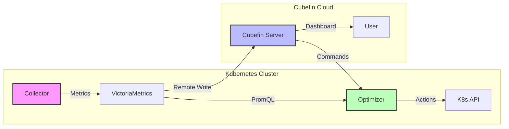

<div align="center">

# Cubefin
**Cloud Native FinOps & Optimization Platform**

[](https://opensource.org/licenses/Apache-2.0)
[](https://cubefin.io)
[](https://slack.cubefin.io)

**Cubefin** is an open-source platform designed to provide visibility into Kubernetes costs and automate resource optimization.
From startups to enterprises, Cubefin helps you run your clusters efficiently.

---

</div>

## 🏗️ Architecture

Cubefin consists of three main components working together to collect, analyze, and optimize your Kubernetes resources.



## 📦 Core Components

| Component | Description | Status |
|-----------|-------------|--------|
| **[Collector](https://github.com/cubefin/collector)** | Lightweight metrics collector based on Prometheus/VictoriaMetrics. | ✅ Stable |
| **[Agent](https://github.com/cubefin/agent)** | Manages cluster registration and communication with the central server. | ✅ Stable |
| **[Optimizer](https://github.com/cubefin/optimizer)** | Automated resource optimization agent (Right-sizing, Scaling). | ✅ Stable |
| **[Helm Charts](https://github.com/cubefin/helm-charts)** | Easy installation managing all components. | ✅ Stable |

## 🚀 Getting Started

Deploy the full stack to your Kubernetes cluster in minutes using Helm.

```bash
# Add the Cubefin Helm repository
helm repo add cubefin https://cubefin.github.io/helm-charts
helm repo update

# Install Cubefin Stack
helm upgrade --install cubefin cubefin/cubefin-cluster \
  --namespace cubefin-system \
  --create-namespace \
  --set global.cluster.token="YOUR_TOKEN"
```

## 🤝 Community & Support

- **Website**: [https://cubefin.io](https://cubefin.io)
- **Documentation**: [https://docs.cubefin.io](https://docs.cubefin.io)
- **Issues**: Please file issues in the respective component repositories.
- **Email**: [admin@cubefin.io](mailto:admin@cubefin.io)

---

<div align="center">
  <sub>Built with ❤️ by the Cubefin Team</sub>
</div>
