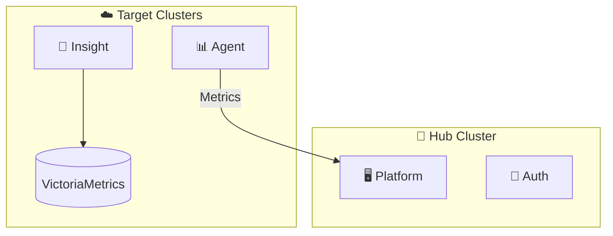

<p align="center">
  
</p>

<h1 align="center">CubeFin</h1>

<p align="center">
  <strong>AI-Powered Kubernetes FinOps Platform</strong><br/>
  클라우드 비용 최적화와 클러스터 운영 자동화를 위한 통합 플랫폼
</p>

<p align="center">
  <a href="https://github.com/cubefin/docs">Documentation</a> •
  <a href="https://github.com/cubefin/helm-charts">Helm Charts</a>
</p>

---

## Key Capabilities

| 영역 | 기능 | 설명 |
|------|------|------|
| **메트릭 수집** | Prometheus 호환 | 기존 모니터링 생태계와 완벽 통합, 38+ K8s 메트릭 수집 |
| **AI 분석** | Private LLM | 데이터가 외부로 나가지 않는 온프레미스 AI 분석 |
| **권한 관리** | ReBAC | Google Zanzibar 개념 기반, 복잡한 조직 구조에 최적화 |

> 모든 데이터는 고객 환경 내에서 처리되며, 외부로 유출되지 않습니다.

---

## Architecture



---

## Core Services

| Service | Description | Repository |
|---------|-------------|------------|
| **Platform** | 중앙 관리 콘솔 및 API 서버 | [cubefin/platform](https://github.com/cubefin/platform) |
| **Agent** | K8s 메트릭 수집 에이전트 | [cubefin/agent](https://github.com/cubefin/agent) |
| **Insight** | Private LLM 기반 AI 분석 | [cubefin/insight](https://github.com/cubefin/insight) |
| **Auth** | 통합 인증/인가 (Edge Gateway + ReBAC) | [cubefin/auth](https://github.com/cubefin/auth) |

---

## Quick Start

```bash
# Hub 클러스터
helm install cubefin-platform oci://ghcr.io/cubefin/cubefin-platform -n cubefin --create-namespace
helm install cubefin-auth oci://ghcr.io/cubefin/cubefin-auth -n cubefin

# 타겟 클러스터
helm install cubefin-cluster oci://ghcr.io/cubefin/cubefin-cluster -n cubefin --create-namespace
helm install cubefin-insight oci://ghcr.io/cubefin/cubefin-insight -n cubefin
```

👉 **설치 가이드**: [cubefin/helm-charts](https://github.com/cubefin/helm-charts)

---

<p align="center">
  <sub>Copyright © 2026 CubeFin. All rights reserved.</sub>
</p>
