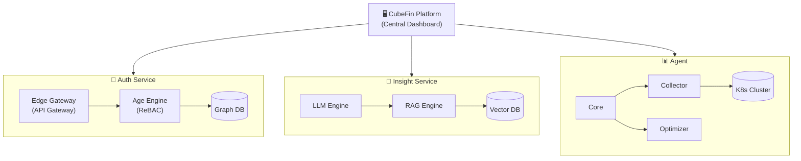

<p align="center">
  
</p>

<h1 align="center">CubeFin</h1>

<p align="center">
  <strong>AI-Powered Kubernetes FinOps Platform</strong><br/>
  클라우드 비용 최적화와 클러스터 운영 자동화를 위한 통합 플랫폼
</p>

<p align="center">
  <a href="#overview">Overview</a> •
  <a href="#key-capabilities">Key Capabilities</a> •
  <a href="#core-services">Core Services</a> •
  <a href="#coming-soon">Coming Soon</a> •
  <a href="#architecture">Architecture</a> •
  <a href="#getting-started">Getting Started</a> •
  <a href="#demo">Demo</a>
</p>

---

## Overview

**CubeFin**은 Kubernetes 환경에서 **FinOps(Financial Operations)** 를 실현하는 AI 기반 플랫폼입니다.

- 멀티 클러스터 메트릭 수집 및 분석
- Private LLM을 활용한 자연어 인사이트 제공
- 비용 최적화 권장 및 자동화
- 엔터프라이즈급 인증/인가 체계

> 모든 데이터는 고객 환경 내에서 처리되며, 외부로 유출되지 않습니다.

---

## Key Capabilities

| 영역 | 기능 | 설명 |
|------|------|------|
| **메트릭 수집** | Prometheus 호환 | 기존 모니터링 생태계와 완벽 통합, 38+ K8s 메트릭 수집 |
| **AI 분석** | Private LLM | 데이터가 외부로 나가지 않는 온프레미스 AI 분석 |
| **권한 관리** | Relationship-Based Access Control | Google Zanzibar 개념 기반, 복잡한 조직 구조에 최적화 |
| **벡터 검색** | RAG (Retrieval-Augmented Generation) | 과거 분석 이력 기반 컨텍스트 인식 응답 |

### 권한 관리 (ReBAC)

전통적인 역할 기반(RBAC)을 넘어, **관계 기반 접근 제어**를 제공합니다.

```
"사용자 A는 팀 B의 멤버이고, 팀 B는 부서 C에 속하며, 부서 C는 프로젝트 D에 접근 가능하다"
→ 사용자 A는 프로젝트 D에 접근할 수 있는가? ✓
```

**해결하는 문제:**
- 복잡한 조직 계층 구조 (그룹 → 하위그룹 → 리소스)
- 동적 권한 위임 및 상속
- 실시간 권한 체크 (밀리초 단위 응답)

---

## Core Services

### 1. Platform

**중앙 관리 콘솔 및 API 서버**

멀티 클러스터를 통합 관리하는 대시보드와 백엔드 서비스입니다.

| 컴포넌트 | 역할 |
|----------|------|
| **Console** | React 기반 웹 대시보드, 클러스터 현황/비용 시각화 |
| **Server** | Quarkus 기반 REST API, 메트릭 집계/분석/저장 |

**주요 기능:**
- 멀티 클러스터 통합 뷰
- 비용 분석 및 트렌드 시각화
- 리소스 최적화 권장사항 표시
- Agent 관리 및 설정 배포

```
📦 ghcr.io/cubefin/platform
```

---

### 2. Agent

**Kubernetes 클러스터 모니터링 에이전트**

클러스터에 배포되어 실시간 메트릭을 수집하고 중앙 서버와 통신합니다.

| 모듈 | 역할 |
|------|------|
| **Core** | 중앙 서버 통신, 설정 관리, 모듈 조율 |
| **Collector** | 인프라/애플리케이션 메트릭 수집 (Prometheus 호환) |
| **Optimizer** | 실시간 최적화 분석, VPA 권장, 노드 효율성 분석 |

```
📦 ghcr.io/cubefin/agent
```

---

### 3. Insight

**Private LLM 기반 AI 분석 엔진**

수집된 메트릭을 AI로 분석하여 자연어 인사이트를 제공합니다.

| 기능 | 설명 |
|------|------|
| **자연어 질의** | "CPU 높은 Pod는?" 같은 질문에 답변 |
| **이상 탐지** | 메모리 초과, CPU 스파이크, 재시작 패턴 감지 |
| **최적화 권장** | 비용 절감, 리소스 조정 제안 |
| **RAG** | 벡터 DB 기반 컨텍스트 인식 응답 |

```
📦 ghcr.io/cubefin/insight
```

---

### 4. Auth

**통합 인증/인가 플랫폼**

엔터프라이즈 환경을 위한 보안 게이트웨이입니다.

| 컴포넌트 | 역할 |
|----------|------|
| **Edge Gateway** | JWT 검증, 트래픽 진입점, 프로토콜 변환 |
| **Age (Access Governance Engine)** | ReBAC 기반 세분화된 권한 관리 |

**특징:**
- Vendor Agnostic: Keycloak, Auth0, Cognito 등 모든 OIDC 호환 IdP 지원
- Cypher 쿼리 기반 Graph DB로 복잡한 조직 구조 권한 처리
- Edge Gateway: API Gateway + 인증/인가 통합, 마이크로서비스 진입 전 검증 완료

```
📦 ghcr.io/cubefin/auth
```

---

## Coming Soon

| 서비스 | 설명 | 상태 |
|--------|------|------|
| **Lens** | 통합 옵저버빌리티 - Logs, Traces, Metrics 통합 뷰 | 🚧 개발 예정 |
| **Flow** | CI/CD 자동화 - 파이프라인 오케스트레이션 | 🚧 개발 예정 |
| **Genesis** | 인프라 프로비저닝 - VM 생성, K8s 클러스터 자동화 | 🚧 개발 예정 |

---

## Architecture



---

## Getting Started

모든 서비스는 **Helm Chart**를 통해 간편하게 설치할 수 있습니다.

| Chart | 설명 | 설치 대상 |
|-------|------|-----------|
| `cubefin-platform` | 중앙 관리 서버 (Console, API) | Hub 클러스터 |
| `cubefin-cluster` | 메트릭 수집 스택 (Agent, Collector, Optimizer) | 타겟 클러스터 |
| `cubefin-insight` | AI 분석 엔진 | 타겟 클러스터 |
| `cubefin-auth` | 인증/인가 서비스 | Hub 클러스터 |

👉 **설치 가이드**: [cubefin/helm-charts](https://github.com/cubefin/helm-charts)

---

## Demo

| 서비스 | 데모 사이트 | 설명 |
|--------|-------------|------|
| **Insight** | [insight.demo.cubefin.io](https://insight.demo.cubefin.io) | AI 분석 데모 - 자연어 질의 체험 |
| **Auth** | [auth.demo.cubefin.io](https://auth.demo.cubefin.io) | 인증/인가 데모 - ReBAC 권한 관리 |

**Auth 데모 계정:**
| 계정 | 비밀번호 | 역할 |
|------|----------|------|
| `admin` | `password` | 관리자 |
| `alice`, `bob`, `charlie`, `dave` | `password` | 일반 사용자 |

---

## License

Copyright © 2026 CubeFin. All rights reserved.
